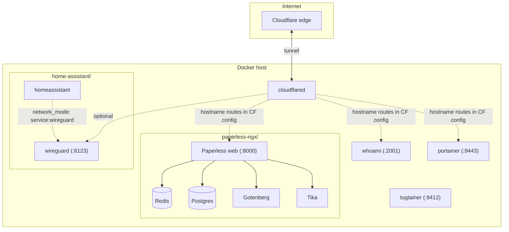

# Docker stacks

This repository holds several **independent** Docker Compose projects under `/opt/docker`. Each folder has its own `docker-compose.yml`; start them from that folder with `docker compose up -d`.

| Directory | Purpose |
|-----------|---------|
| [`cloudflare/`](cloudflare/) | Cloudflare Tunnel (`cloudflared`) for exposing services without opening inbound ports |
| [`home-assistant/`](home-assistant/) | Home Assistant behind WireGuard (shared network, port `8123` on the WireGuard side) |
| [`paperless-ngx/`](paperless-ngx/) | Document management (Paperless-ngx, PostgreSQL, Redis, Tika, Gotenberg) |
| [`portainer/`](portainer/) | Web UI for Docker management |
| [`tugtainer/`](tugtainer/) | [Tugtainer](https://github.com/Quenary/tugtainer) — Docker image checks/updates with web UI (host port **9412**) |
| [`whoami/`](whoami/) | Small HTTP echo service for testing routing and tunnels |

### Architecture overview

Traffic from the internet typically reaches your apps through **Cloudflare Tunnel** (`cloudflared`), which connects outbound to Cloudflare and forwards to host ports you map in the tunnel config. **Paperless-ngx** is one internal app mesh (web + Redis + Postgres + converters). **Home Assistant** shares the **WireGuard** container’s network so the UI is reachable on **8123** via that stack’s published port. **Tugtainer** (optional) talks to Docker via a **socket-proxy** sidecar and offers a UI to check or apply container image updates.



Solid arrows are direct dependencies or data paths. Dashed lines from `cloudflared` are **not automatic**: they reflect whatever you configure in Cloudflare (public hostnames → `http://localhost:…` or similar).

---

## `cloudflare/` — Cloudflare Tunnel

- **`cloudflared`** — Runs `tunnel run` using credentials from `cloudflare/.env` (not committed). Forwards traffic from Cloudflare’s edge to services on your network according to your tunnel config in the Cloudflare dashboard or local config.

---

## `home-assistant/` — Home Assistant + WireGuard

Two services share one network namespace so Home Assistant’s traffic can go through the VPN.

- **`wireguard`** (`lscr.io/linuxserver/wireguard`) — WireGuard VPN server/client. Needs `NET_ADMIN`, `SYS_MODULE`, and `/dev/net/tun`. Config and keys live under `home-assistant/wireguard/`. Publishes host port **8123** (mapped into the shared stack network for Home Assistant’s UI).
- **`homeassistant`** (`ghcr.io/home-assistant/home-assistant:stable`) — Home automation hub. Uses `network_mode: service:wireguard`, so it does not publish ports itself; reach the UI via **8123** on the host as exposed by WireGuard. Configuration is in `home-assistant/config/` (see `.gitignore` for secrets and runtime paths).

Timezone is set to `Europe/Paris` in compose.

---

## `paperless-ngx/` — Paperless-ngx

Document scanning, OCR, and archive workflow. Web UI on host port **8000**.

- **`broker`** — **Redis 8** for Celery / caching (`redisdata` volume).
- **`db`** — **PostgreSQL 18** for the application database (`pgdata` volume). Default user/db name `paperless` (password set in compose; override for production).
- **`webserver`** — **Paperless-ngx** app. Mounts `./data`, `./media`, `./export`, and consume dir at `/opt/docker/paperless-ngx/consume`. Uses `docker-compose.env` for app secrets and settings (gitignored).
- **`gotenberg`** — Converts documents (e.g. Office formats); Chromium is locked down (no JS, allow-list) for safer conversions including `.eml`.
- **`tika`** — **Apache Tika** for text/metadata extraction; used with Gotenberg for rich document ingestion.

---

## `portainer/` — Portainer CE

- **`portainer`** — **Portainer Community Edition** web UI on **9443** (HTTPS). Mounts the Docker socket and a named volume `portainer_data` for Portainer’s own data. `no-new-privileges` is enabled.

---

## `whoami/` — Traefik Whoami

- **`whoami`** (`traefik/whoami`) — Minimal HTTP service that returns request headers and identity; listens on **2001** (`--port=2001`). Useful for verifying reverse proxies and tunnels. The compose file uses an **armv7** image tag; adjust the image if your host is amd64 or arm64.

---

## `tugtainer/` — Tugtainer

- **`socket-proxy`** (`lscr.io/linuxserver/socket-proxy`) — Read-only access to `docker.sock` for the API subset Tugtainer needs; see the [upstream compose](https://github.com/Quenary/tugtainer/blob/main/docker-compose.app.yml) for environment flags. Attached only to the internal **`tugtainer`** network.
- **`tugtainer`** (`ghcr.io/quenary/tugtainer:1`) — Web UI on host port **9412** (maps to port 80 in the container). Persistent data in volume `tugtainer_data`. Uses `DOCKER_HOST=tcp://socket-proxy:2375` (no direct socket mount on the app container).

Both services are labeled `dev.quenary.tugtainer.protected=true` so Tugtainer does not try to auto-update itself or the proxy from within the app (see [custom labels](https://github.com/Quenary/tugtainer/blob/main/README.md#custom-labels)). Complete the initial auth/password flow in the UI after first start. Remote hosts require a separate **Tugtainer Agent** stack (not included here). Notifications can use [Apprise URLs](https://github.com/Quenary/tugtainer/blob/main/README.md#notifications) directly in the Tugtainer UI (no separate Apprise API stack in this repo).

---

## Secrets and gitignored files

See [`.gitignore`](.gitignore): `.env` files, Paperless `docker-compose.env`, Home Assistant `secrets.yaml`, WireGuard `*.conf`, and Paperless data directories are excluded from version control. Copy any `*.example` files and fill in values before first run.

---

## Typical usage

```bash
cd /opt/docker/<stack-name>
docker compose pull
docker compose up -d
```

Order of deployment is flexible; **Portainer** and **Tugtainer** are optional operational tools. **Cloudflared** requires a valid tunnel token or credentials in `cloudflare/.env`. **Home Assistant** requires WireGuard configuration under `home-assistant/wireguard/` before the stack is useful.
