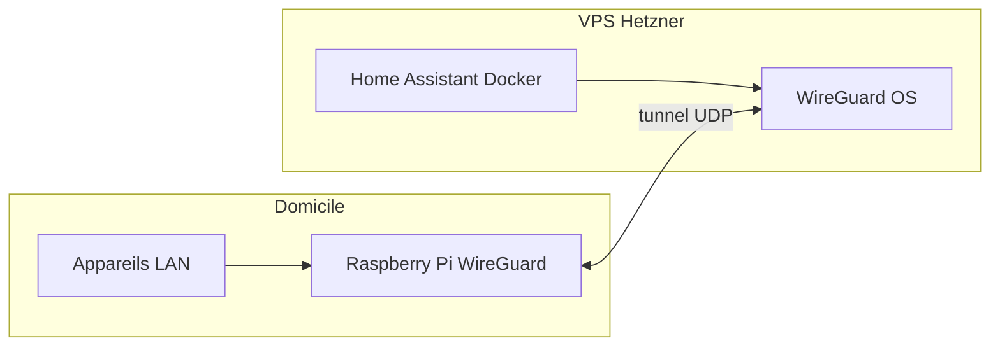

# Home Assistant + WireGuard — Architecture CLEAN (VPS multi‑services)

## 🎯 Objectif

Permettre à **Home Assistant (Docker sur un VPS Hetzner)** d’accéder de manière **sécurisée** aux appareils d’un **réseau local domestique**, via un **Raspberry Pi passerelle**, sans ouvrir de ports chez soi.

---

## ✅ Principes d’architecture

- ✅ **WireGuard installé sur l’OS du VPS (pas Docker)**
- ✅ **Home Assistant en Docker non privilégié**
- ✅ **VPS multi‑services respecté**
- ✅ **Aucun port ouvert sur la box Internet**
- ✅ **Isolation réseau propre**
- ✅ **Maintenance simple**

---

## 🧱 Architecture finale

Flux logique : **Internet** → **VPS Hetzner** (WireGuard sur l’OS + Home Assistant en Docker) ↔ **tunnel WireGuard** ↔ **Raspberry Pi** (pair WireGuard + accès LAN) → **appareils domestiques**. Le tunnel est initié **depuis le domicile vers le VPS** (sortant), donc aucun port entrant sur la box.

---

## Utilisateur et permissions — WireGuard sur le VPS (serveur)

Pour une installation **classique sur l’OS** (Debian/Ubuntu, `wg-quick` + systemd) :

| Étape | Utilisateur |
|--------|-------------|
| **Installation des paquets** (`apt`, etc.) | Compte avec **`sudo`**, ou **`root`** |
| **Création / édition de** `/etc/wireguard/wg0.conf` | **`sudo`** ou **`root`** (le répertoire `/etc/wireguard` appartient à root) |
| **Exécution du tunnel** (`wg-quick@wg0.service`) | **`root`** — le service systemd tourne en root ; c’est **normal et requis** pour créer l’interface `wg0`, les routes IP et les règles pare-feu / NAT éventuelles |
| **Fichiers de config / clés** | Propriétaire **`root:root`**, permissions **`600`** sur `wg0.conf` (pas lisible par les autres) |

Il n’y a en général **pas** d’utilisateur système dédié « wireguard » : le démon n’est pas un service applicatif qui abandonne ses privilèges.

**Home Assistant en Docker** : l’utilisateur à l’intérieur du conteneur n’a **rien à voir** avec celui qui exécute WireGuard sur l’hôte. Seules les **routes**, **adresses du tunnel** et **règles firewall** sur le VPS doivent permettre à HA d’atteindre les IPs du tunnel / du réseau distant selon ta config.

**Écart avec ce dépôt** : le fichier [home-assistant/docker-compose.yml](home-assistant/docker-compose.yml) utilise encore le conteneur **linuxserver/wireguard**. Ce document décrit la cible **CLEAN** (WireGuard **sur l’OS** du VPS).

---

## Installation du serveur WireGuard sur le VPS

1. **Paquets** (en tant qu’utilisateur avec `sudo`) :
   - `sudo apt update && sudo apt install -y wireguard wireguard-tools`
2. **Clés** : générer une paire de clés serveur (`wg genkey` / `wg pubkey`) et les clés des pairs (ex. Raspberry Pi) ; ne jamais committer les clés privées.
3. **Configuration** : créer `/etc/wireguard/wg0.conf` (adresse du serveur sur le tunnel, `ListenPort`, section `[Peer]` pour le Pi, etc.). Adapter `PostUp` / `PostDown` si tu fais du NAT ou du forwarding vers d’autres services.
4. **Permissions** : `sudo chmod 600 /etc/wireguard/wg0.conf` et propriétaire `root:root`.
5. **Démarrage au boot** :
   - `sudo systemctl enable --now wg-quick@wg0`
6. **Vérification** : `sudo wg show` ; le service **`wg-quick@wg0`** s’exécute **en root** — ne pas tenter de le faire tourner sous un utilisateur non privilégié sans une pile réseau dédiée (hors usage courant).

Ouvre le port **UDP** du `ListenPort` dans le **firewall du VPS** (Hetzner Cloud firewall / `ufw` / nftables selon ton setup). Aucun port entrant n’est requis **chez toi** si le Pi initie la connexion vers le VPS.

---

## Installation WireGuard sur le Raspberry Pi (passerelle)

Le Pi joue le rôle de **pair** qui maintient le tunnel vers le VPS et donne accès au **LAN domestique** (selon routing / `AllowedIPs`).

### Utilisateur et permissions

Même logique que sur le VPS :

| Étape | Utilisateur |
|--------|-------------|
| **Installation** (`apt`) | **`sudo`** ou **`root`** |
| **Fichiers dans** `/etc/wireguard/` | Édition en **`sudo`** ; `wg0.conf` en **`600`**, **`root:root`** |
| **Service** `wg-quick@wg0` | Exécution **`root`** via systemd |

### Étapes d’installation (Raspberry Pi OS / Debian)

1. `sudo apt update && sudo apt install -y wireguard wireguard-tools`
2. Créer `/etc/wireguard/wg0.conf` côté **client** : `[Interface]` avec l’IP du Pi sur le tunnel, clé privée du Pi ; `[Peer]` avec clé publique du **serveur** VPS, `Endpoint` = IP ou hostname public du VPS + port UDP, `AllowedIPs` selon ce que le Pi doit router (ex. seulement le sous-réseau du tunnel, ou aussi le LAN du VPS / HA selon ton design).
3. `sudo chmod 600 /etc/wireguard/wg0.conf`
4. `sudo systemctl enable --now wg-quick@wg0`

### Passerelle vers le LAN

Si le VPS (ou Home Assistant) doit joindre des machines **derrière** le Pi :

- Activer le **forwarding IPv4** sur le Pi (`sysctl net.ipv4.ip_forward=1`, persistant dans `/etc/sysctl.d/`).
- Ajuster **`AllowedIPs`** sur le **serveur** VPS pour inclure le sous-réseau LAN domestique derrière le Pi.
- Sur le Pi, règles **iptables** ou **nftables** (NAT / forwarding) pour renvoyer le trafic du tunnel vers le LAN, selon ta topologie exacte.

Tester avec `ping` entre le VPS et une IP LAN une fois le tunnel `Established` (`sudo wg` sur les deux bouts).